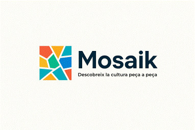

# 👤 Mari Paz Sanz Nadal

## 💻 Presentació
Sóc estudiant del cicle **Desenvolupament d’Aplicacions Web** a l’IES l’Estació d’Ontinyent.  
M’interessa especialment el desenvolupament **frontend/backend** i les tecnologies relacionades amb **HTML, CSS, JavaScript, Python, java, altres llenguatges**.

---

## 🚀 Projecte personal
**Nom del projecte:** *Marketplace* *cultural* amb el nom de *Mosaik*

**Descripció:**
És un marketplace cultural que connecta professionals, artistes i amants de la cultura.
El nostre objectiu és donar visibilitat a la cultura local i oferir experiències úniques per a tots els públics: des de tallers artesanals fins a rutes guiades i productes culturals exclusius.

---

## 🧰 Tecnologies i eines que utilitze
- HTML, CSS, JavaScript
- Python / Flask
- Git i GitHub
- MkDocs

---

## 🌱 Objectius d’aprenentatge
1. Millorar en l’ús de Git i GitHub (branques, commits, PR).
2. Aprendre bones pràctiques de desplegament web.
3. Publicar documentació tècnica clara amb MkDocs.

---

## 🔗 Enllaços d’interés
- [El meu perfil de GitHub](https://github.com/mpsn92)
- [Projecte personal al repositori](https://github.com/mpsn92/DAWSemi_2025-2026)
- No tinc pagina de desplegament perque encara es un projecte inicial

---

## 💬 Frase o curiositat
> "Poc a poc tot va eixint avant" 

> "Treballar amb música es treballar amb alegria"

---

## 🖼️ Foto o logotip

